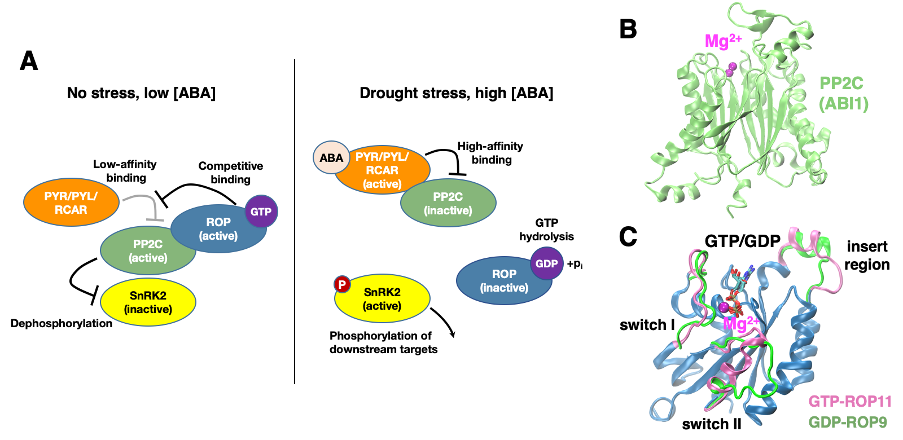

# GTPase_czhao_2025

Code and supporting files for the paper:  
**[Structural Basis for Negative Regulation of ABA Signaling by ROP11 GTPase](https://www.biorxiv.org/content/10.1101/2020.05.20.107185v2)**  

## Initial_Structural_Refinement_all_atom
- Input structures for initial refinement using all-atom MD simulations.
- Input scripts for minimzation, equilibration and production simulations.
- Parameter/topology files.

## ROP11_ABI1_Association_coarse_grained
- Input files/scripts use for setting up the coarse-grained system, including the complex structures as well as martini files.
- Parameter, topology and input scripts for coarse-grained simulations.
- Markov state model ,TICA objects.
- Pre/post processing scripts.

## Candidate_Complexes_all_atom
- Input structures of candidate compelxes derived from coarse-grained simulations.
- Inputs scripts for all-atom MD simulations.
- Parameter/topolgy files for all candidate complexes.
- Pre/post processing scripts.
